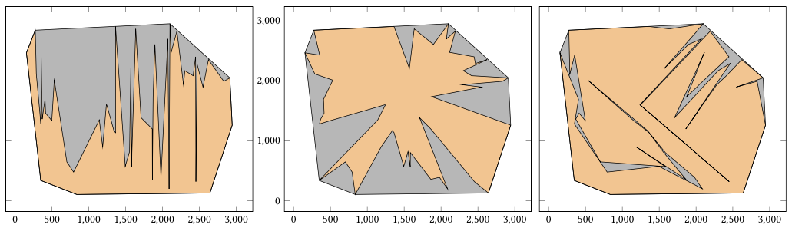

# Optimal Area Polygonization

**Problem:** Polygonization of a point-set **S** with **n** points in $\mathbf{R}^2$, to have optimal area (minimal or maximal).



A detailed report of this project it is provided in the `Report.pdf` file.

## Usage
**Dependency:** Make sure you have CGAL installed, or download it from [here](https://www.cgal.org/download.html).  

Go to `build/` directory and run:

```
$ cmake .. && make
$ ./optimal_polygon -i <input file> -o <output file> 
  -algorithm <local_search/simulated_annealing/ant_colony> 
  -init_algo <onion/ch2poly | except ant_colony>
  -L [L parameter according to algorithm]  
  –max [maximal area polygonization]  
  –min [minimal area polygonization]  
  –threshold <double only in in local search>  
  –annealing <local/global/subdivision only in simulated annealing>
  -alpha <double> -beta <double> -rho <double> elitism <0 or 1> 
  [alpha, beta, rho, elitism only in ant_colony]
```

## Authors
* [Kyriakopoulos Dimitrios](https://github.com/dimitrskpl)<sup>*</sup>
* [Poulis Angelos](https://github.com/angelosps)<sup>*</sup>  
* [Rontogiannis Dimitrios](https://github.com/rondojim)<sup>*</sup>


<sup>*</sup>_Equal contribution._

